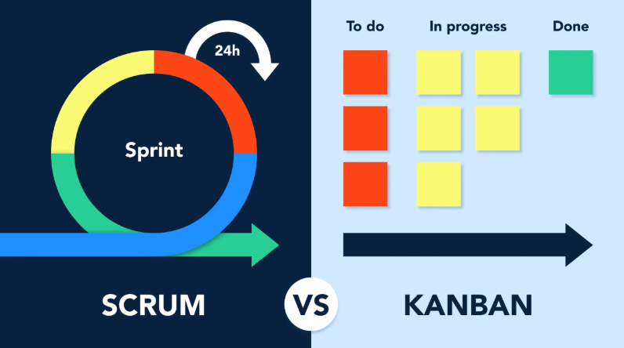
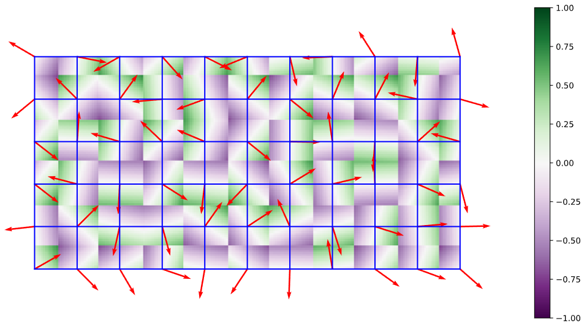
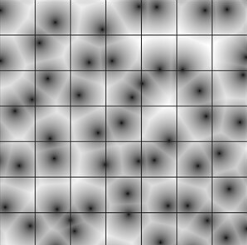
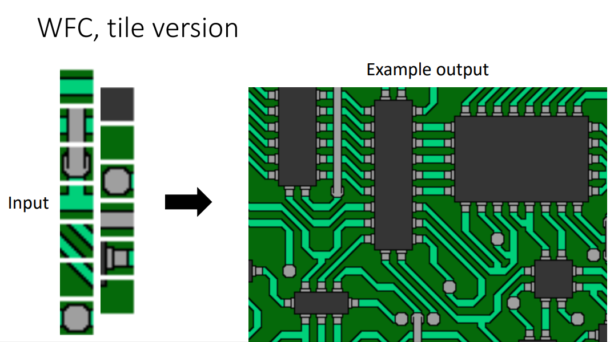

# Vývoj počítačových her

## Programování počítačových her

### Vývoj herních mechanik

- Cena x Benefit
- Zábavnost
- Intuitivnost

### Herní návrhové vzory

- V kódu
  - Singleton: jedna instance
  - Factory: generátor věcí
- V organizaci objektů
  - Komponentový systém
  - Skriptovací model

### Skriptování her

- Tweeny
- C#, Python

## Architektura herních enginů

### Vrstvy architektur

- Vstupní vrstva: Zpracování vstupů hráče
- Logická vrstva: Herní pravidla a simulace
- Grafická vrstva: Rendering objektů
- Zvuková vrstva: Zvukové efekty a hudba
- Síťová vrstva: Multiplayer komunikace

### Výpočetní modely

- Herní smyčka
  - Hráčův vstup
  - Aktualizace světa
    - Posun objektů
    - Kontrola kolizí
    - Úprava rychlostí a pozic
  - Vykreslení světa
  - Přehrání zvuků

Single-thread vs Multi-thread

### Entity-Component System

Způsob, jak reprezentovat GameObjecty.
Objekt má komponenty, každá zaručuje nějakou funkcionalitu.
Efektivnější pro paměť, protože je to struct v zásobníku a ne třída na haldě.

### Správa paměti

- Cache locality: Organizace dat ve hře ovlivňuje výkon procesoru.
- Přidělování a uvolňování paměti: Optimalizace pro snížení fragmentace.

### Příklady konkrétních instancí architektur

- Unity: Používá GameObject-Component model.
- Unreal Engine: Využívá Actor-based model.
- Godot: Node-based systém.

## Herní design

### Kdo je herní designér

Herní designér vytváří:

- Pravidla a mechaniky hry.
- Level design: Rozložení mapy a prostředí.
- User experience (UX): Jak hráč vnímá hru.

### Osy herního designu

- Systémová osa: Mechaniky, pravidla, AI.
- Estetická osa: Grafika, zvuk, atmosféra.
- Narativní osa: Příběh, dialogy, mise.

### Herní žánry

- FPS: First-Person Shooter
- RPG: Role-Playing Game
- RTS: Real-Time Strategy
- MMO: Massive Multiplayer Online
- Indie: Amatérské hry vyvíjené malými týmy nebo jednotlivci

### Specifika herních platforem

Různé vstupy, výkon a monetizace.

- PC
- Mobilní
- Konzole
- Handheld

### Game Design Dokument

- Vlastnosti: Kompletní dokumentace mechanik, postav, UI, příběhu.
- Struktura: Přehledná hierarchie s UML diagramy.
- Herní prostor: Prostředí, levely.
- Postavy: AI, NPC, hráč.
- Specifikace dialogů: Stromové dialogy pro RPG.

### Historie herního trhu

Arcade era -> PC era -> Mobilní revoluce -> Vývoj monetizačních modelů.

## Vývojový cyklus počítačové hry

### Fáze vývojového cyklu

- Předprodukce: Koncept, prototypy.
- Produkce: Programování, design, testování.
- Postprodukce: Opravy bugů, DLC.

### Herní design řízený daty

A/B testování, telemetrie: Analýza chování hráčů pro optimalizaci herních mechanik.

### Správa dat

Cloudové ukládání, verzování.

### Testování počítačových her

Unit testy, beta testy, QA.

### Vývojářské role

Programátor, designér, tester, producent.

### Herní analytiky

Analýza chování hráčů, monetizace.

### Vodopádový model a agilní metodiky návrhu her



### Obchodní modely komercializace her

Premium, F2P, Subscription, Ad-based.

## Narativita a hry

### Rozdíl mezi games of emergence a games of progression

- Emergence: Hráč vytváří příběh (sandbox hry).
- Progression: Lineární příběh (RPG, FPS).

### chtěná a nechtěná emergence

Chtěná: Např. sandbox mechaniky Minecraftu.
Nechtěná: Bugy způsobující neplánované interakce.

### environmentální storytelling

Vyprávění příběhu skrze prostředí (např. Dark Souls, Bioshock)

### procedurální rétorika

Hra jako argument: Např. Papers, Please ukazuje politické dilema

### ludonarativní disonance

Konflikt mezi příběhem a mechanikou: Např. Nathan Drake jako vrah v Uncharted, ale sympatický v cutscénách

# Počítačová grafika pro hry

## Pojmy

### Homogenní souřadnice

Homogenní souřadnice umožňují reprezentaci bodů a transformací v geometrickém prostoru s využitím matice vyšší dimenze.
Používají se pro sjednocení translací, rotací a škálování do jednoho matematického modelu.
Přidáním čtvrté souřadnice (w) do 3D prostoru umožňují snadnou aplikaci perspektivních projekcí.

Například bod $[x, y, z]$ lze v homogenních souřadnicích zapsat jako $[x, y, z, w]$, kde $w \neq 0$.

### Afinní a projektivní transformace v rovině a v prostoru

Afinni \~ Ortogonalni

Afinní transformace zahrnují operace jako translace, rotace, škálování a šikmé posunutí, které zachovávají rovnoběžnost přímek.
Projektivní transformace rozšiřují afinní transformace o perspektivní zkreslení, což je klíčové pro modelování 3D scén.
Typický příklad projektivní transformace je pohledová projekce ve 3D grafice.

### Kvaterniony

Kvaterniony slouží k reprezentaci rotací ve 3D prostoru bez singularit spojených s Eulerovými úhly (gimbal lock).
Jsou čtyřrozměrným rozšířením komplexních čísel ve tvaru $q = w + xi + yj + zk$, kde $w$ je skalární část a $x, y, z$ jsou imaginární.
Jsou efektivní pro interpolaci rotací pomocí SLERP (Spherical Linear Interpolation).

## Křivky

### Spline funkce

Spline funkce jsou hladké křivky používané k aproximaci nebo interpolaci datových bodů.
Nevýhodou je, že pokud se pohne 1 bod, křivka už nebude spojitá a musí se dorovnat všechny ostatní body (kubická varianta tento problém nemá).


### Interpolace kubickými spliny

Řetěz spojených křivek.
Kubické spliny jsou specifické typy spline funkcí, které interpolují mezi body tak, aby byla zajištěna spojitost první a druhé derivace.

### Bézierovy křivky

Bézierovy křivky jsou definované kontrolními body a Bernsteinovými polynomy.
Umožňují tvorbu hladkých křivek a jsou klíčové v grafickém designu.

- Lineární Bézierova křivka: Lerp(A, B, t)
- Kvadratická Bézierova křivka: Lerp(Lerp(A, B, t), Lerp(B, C, t), t)
- Kubická Bézierova křivka: Lerp mezi 2 kvadratickými Bézierovými křivkami.


### Catmull-Rom spliny


Vyčází z Cubic Hermite spline.
2 body a 2 vektory (vstupní a výstupní).

### B-spliny

B-spliny jsou zobecněním Bézierových křivek, umožňují lokální kontrolu nad tvarem křivky.
Jsou vhodné pro modelování složitých tvarů v CAD systémech.


## Textury

### Vzorkování a kvantování obrazu

Vzorkování (sampling) je proces získávání hodnot z textury (přečtení pixelů).

Kvantování omezuje počet úrovní intenzity, což snižuje náročnost na paměť.
Například převod z reálných čísel na diskrétní hodnoty.

### Anti-aliasing

Anti-aliasing redukuje zubaté okraje (aliasing) v obrazu.
Aplikuje se pouze na pixelech obsahujících hranu 2 trojúhelníků.

Metody:

- MSAA (Multi-Sample Anti-Aliasing): více vzorků pro 1 pixel (2, 4, 8, 16 vzorků)
- SSAA (Super-Sample Anti-Aliasing): více pixelů pro 1 pixel (2, 4, 8, 16)
- FXAA (Post-processing): v podstatě rozmaže / zprůěměruje pixely s vysokým kontrastem vůči okolí

### Textury

Textury se používají k přidání detailů na povrch objektů.
Mohou být 2D, 3D nebo procedurální.
Příkladem je texturování dřeva nebo kamene.

### Změna kontrastu a jasu

Manipulace s kontrastem a jasem mění vzhled textury.
Tyto úpravy lze provést pomocí lineární transformace intenzity pixelů.

### Kompozice poloprůhledných obrázků

Při kompozici poloprůhledných obrázků se používá alfa kanál, který určuje průhlednost.
Kombinace barev probíhá například pomocí operace "over" v alfa kompozici.

## Reprezentace 3D scén

### Výpočet viditelnosti

Určuje, které části scény jsou viditelné z určitého pohledu.

Metody:

- Z-buffering (depth textura / buffer): rasterizace
- BSP stromy (Binary Space Partitioning): ray tracing

### Výpočet vržených stínů

Vržené stíny přidávají hloubku do scény.

Metody:

- Shadow mapping (světlo renderuje hloubku do textury)
- Path tracing (každý pixel vysílá paprsek směrem ke světlu)

### Měkké stíny

Měkké stíny simulují přirozené rozmazání, které vzniká díky rozptylu světla.

Metody:

- Ray tracing to má implicitně (pokud světlo není bodové)
- Shadow mapping: zkoumá okolní pixely (pixel filtering)

### Rozptyl světla pod povrchem

Subsurface scattering.
Simulace průchodu světla materiály, jako je kůže nebo voda.

### Modely osvětlení a stínovací algoritmy

Modely osvětlení (Phong, Blinn-Phong) a stínování (Gouraud, Phong) definují, jak se světlo šíří a odráží na povrchu.

- Lesklá složka (specular)
- Matná složka (diffuse)
  - Odrazová složka (mirror)

### Rekurzivní sledování paprsku

Raytracing.
Simulace světelných cest zahrnující odrazy a refrakce.
Používá se ve filmové grafice, je pomalá, ale realistická.

### Fyzikální model šíření světla

#### Radiometrie

Studium fyzikálních vlastností světla, jako je intenzita, jas a energetický tok.

#### Zobrazovací rovnice

Zobrazovací rovnice (rendering equation) je klíčovým konceptem v radiometrii a počítačové grafice.
Popisuje, jak světlo interaguje s povrchy ve scéně a jak je výsledný obraz vytvořen.
Rovnice bere v úvahu všechny možné cesty světla, které přispívají k osvětlení daného bodu na povrchu.

Matematicky je zobrazovací rovnice vyjádřena jako:

$$L_o(x, \omega_o) = L_e(x, \omega_o) + \int_{\Omega} f_r(x, \omega_i, \omega_o) L_i(x, \omega_i) (\omega_i \cdot n) d\omega_i$$

neboli:
výsledná barva = emitované světlo + světlo z odrazu (= rekurzivní BRDF x světlo x cosine law)

### Algoritmus sledování cest

Path tracing je pokročilá metoda simulující globální osvětlení.
Pro každý pixel se vyšle několik paprsků.
Každý paprsek se odráží po scéně, dokud nenarazí na světlo nebo neskončí po X krocích.

### Předpočítané globální osvětlení

Techniky jako lightmaps ukládají výsledky osvětlení pro rychlejší vykreslování.
Například ve hrách jako World of Warcraft se světlo "zapeče" při kompilaci hry nebo za běhu a poté se používá jeho zacacheovaná hodnota.
Umožňuje pokročilé stíny a barevné efekty, ale jen pro statické objekty.

### Výpočet globálního osvětlení v reálném čase

Real-time GI zahrnuje techniky jako voxel cone tracing nebo ray tracing na GPU.

### Stínování založené na sférických harmonických funkcích

Radiosity vůči environment mapě.
Je to vlastně difúzní složka environment mapy.

### Předpočítaný přenos radiance


Předpočítání environment mapy pomocí sférických harmonických funkcí do parametrů rovnice.
Stačí ji mít jako rovnici s parametry: textura by byla příliš velká a odchylka je < 3s%.

## Animace postav

### Skinning

Skinning váže geometrii na kostru.
Lineární blend skinning je běžný algoritmus používaný ve hrách.

### Rigging

Rigging zahrnuje tvorbu kostry a kontrolních mechanismů pro animaci postavy.

### Morphing

Morphing interpoluje mezi různými tvary nebo animacemi.

## Architektura grafického akcelerátoru

### Předávání dat do GPU

Data jako vertex buffery a textury jsou přenášena z CPU do GPU pomocí API jako OpenGL nebo DirectX.

### Textury a GPU buffery

Textury a buffery jsou optimalizovány pro rychlý přístup během vykreslování.

### Programování GPU shaderů

Shadery jsou malé programy běžící na GPU, které ovlivňují vzhled scény.

## Jazyky

### OpenGL

OpenGL je grafické API umožňující programování 2D a 3D grafiky.

### GLSL

GLSL je jazyk pro psaní shaderů v OpenGL.

### CUDA

CUDA je platforma pro paralelní programování na GPU, využívající výpočetní schopnosti grafické karty.

### OpenCL

OpenCL je standard pro paralelní výpočty na různých typech hardwaru.

## Komprese

### Principy komprese rastrové 2D grafiky

Redukce velikosti obrazových dat odstraněním redundantních informací.
Bezeztrátová komprese zachovává původní obraz, ztrátová redukuje kvalitu.

### Standard JPEG


JPEG je ztrátový kompresní formát, který využívá DCT (diskrétní kosinovou transformaci) a kvantizaci (v závislosti na úrovni DCT) na submatici 8×8.

### Komprese videosignálu

Využívá prostorovou i časovou redundanci pro efektivní ukládání videa.
Používá DCT, pohybové vektory a kvantizaci (v závislosti na úrovni DCT).

Snímky jsou 3 typů:

- I = plný snímek
- P = rozdíl oproti poslednímu I nebo P snímku
- B = rozdíl mezi snímkem před a snímkem po

Například v poměru 2:5:12.

Příkladem je H.264 nebo H.265.

# Umělá inteligence pro počítačové hry

## Architektura autonomního agenta

### Percepce

- Ziskavani informace z prostredi
- Pomoci senzoru

Prostredi muze byt:

- Plne pozorovatelne X castecne pozorovatelne
- Staticke X dynamicke (dynamicke se meni i bez agenta)
- Single-agent X Multi-agent
- Deterministicke X Stochasticke (Kazda akce ma / nema jeden vysledek)
- Diskretni X spojite
- Turn-based X real-time
- Noiseless X Noisy (jestli senzory produkuji nepresna pozorovani)

### Mechanismus výběru akcí

Vezme vjemy a vnistri stavy / pamet.
Vyprodukuje akci cimz zmeni stav (svuj i sveta).

### Paměť

- Reaktivni agenti nemaji pamet
- Stavovi agenti pamet maji / stav

Perceptual aliasing problem = Reakcni agent vnima stejny vjem na 2 ruznych stavech

## Psychologické inspirace

Vycházejí z:

- lidského
- zvířecího chování.

Model BDI:

- Believes: Vnimani sveta
- Desires: Cilovy stav
- Intentions: Akce pro dosazeni cile

## Metody pro řízení agentů

### Symbolické a konekcionistické reaktivní plánování

- Symbolické: logické reprezentace a algoritmy
  - přesnější
- Konekcionistické (sub-symbolic): neuronové sítě, automaty a if-then pravidla
  - flexibilnější v dynamických prostředích

### Hybridní přístupy

Plánovací část používá symbolické plánování pro vytváření plánů.
Reaktivní část rychle reaguje bez větších výpočtů či plánování.

Například může agent využívat logiku pro dlouhodobé plánování a neuronové sítě pro rychlé reakce.

### Prostor rozhodování

Prostor rozhodování popisuje všechny možné akce, které může agent provést.
Optimalizace tohoto prostoru je klíčová pro rychlé a efektivní rozhodování.

### If-then pravidla

Jednoduché reakce na konkrétní podmínky.
Musime vyresit konflikt vicero pravidel naraz, treba tak, ze jim dame priority.
Např: pokud hráč zaútočí, agent se brání, coz je dulezitejsi, nez ze chce spat.

### Skriptování

Skriptování umožňuje tvůrcům her ručně definovat chování agentů pomocí programovacích skriptů.

Behavior oriented design (BOD):

- pripravit uzitecne funkce (`isHungry()`, `hasFood()`)
- ty nasledne pouzivat v scriptu

### Sekvenční konečný automat

Sekvenční konečné automaty reprezentují chování agenta jako množinu stavů a přechodů mezi nimi.
Typický příklad je hlídkující stráž ve stealth hrách.

### Stromy chování

Stromy chování představují hierarchické struktury, které organizují rozhodování agenta.
Jsou snadno čitelné a flexibilní pro komplexní chování.

## Problém hledání cesty

### Lokální navigační pravidla

Řeší lokální pohyb agenta v prostředí.
Metody (aditivne):

- Reynoldsovy steeringy (suma vsech nize vyda vysledny smer)
  - Seek / Flee: miri k / od cile
  - Pursue / Evade: miri k / od pohybliveho cile
  - Wander: nahodny
  - Arrival: zpomalujici se priblizovani k cily
  - Obstacle avoidance: Smer od nejblizsi prekazky
  - Path / Wall following: Sila pritahujici agenta k objektu
- VO (Velocity Obstacle)
  - Zmeri jake rychlosti & smery vedou ke kolizi s pohybujicim se objektem
  - Pak pouzit takovy smer & rychlost, ktera co nejefektivneji vede do cile, ale neni tam kolize
- RVO
  - VO, ale agenti spolupracuji a kazdy se vyhyba jen polovicni intenzitou
- Context Steering
  - Bere vpotaz vsechny cile

Princip:

- pole zajimavych smeru (cile, podle vzdalenosti a smeru)
- pole nebezpecnych smeru (stena)
- pak se pole sectou a vybere se nejlepsi smer

Například obcházení překážek pro dosazeni nejblizsiho cile.

### Hledání cesty

Algoritmy:

- A\*
- JPS+ (jump point search)
  - vyuziva pruning na A\*
  - vytvari z vicero cest se stejnym cilem a vzdalenosti jedinou
  - vytvori jump point tam, kde se zataci kolem rohu steny
- Goal Bounding
  - Predpocita pro kazdy node bounding box smerem z jeho sousedu
- RRT (Rapidly exploring random tree)
  - Nahodne stavime strom:
  - vezmeme nahodny bod na mape
  - najdeme nejblizsi node k nemu
  - pridame z nej node, ktery bude vzdaleny nejakou konstantni vzdalenost
- RRT\*
  - RRT, ale pridava optimalizacni krok
  - node nepridavame z predchoziho, ale nejoptimalnejsiho (rovna cesta k nodu co nejblize koreni)
- LPA\*
  - RRT\* pri pouziti v robotice
  - prostredi se meni a strom take
  - znovupouzivani predchoziho stromu pri preplanovani
- MPAA\* (MultiPath Adaptive A\*)
  - prida k A\* i mapu rodicu a nasledovniku pro nasledujici behy, kdy muzeme skakat po starych cestach dokud se nezmeni
- Bidirectional Search

Zde je text, ve kterém jsem opravil gramatické chyby, přidal háčky a čárky, a zachoval jsem původní styl v markdown formátu:

### Reprezentace prostoru

Prostor může být reprezentován pomocí geometrie (trojúhelníkové sítě), viditelnosti (viditelné grafy) nebo mřížek.
Správná volba ovlivňuje efektivitu navigace.

## Komunikace a znalosti v multiagentních systémech

### Ontologie

Ontologie popisují společnou strukturu znalostí, kterou agenti sdílejí.
Například definují, co je nepřítel, zbraň nebo úkryt.

### Řečové akty

Řečové akty jsou modely komunikace mezi agenty.

Zahrnují:

- Požadavky
- Nabídky
- Příkazy
- Dotazy

### FIPA-ACL

Komunikani protokol pro komunikaic vicero agentů.

Zakladni ukony / schopnosti:

- Informovat
- Ptat se
- Pozadovat
- Subscribe
- Slibovat
- Prijmout
- Odmitnout
- Potvrdit
- Failure

### Protokoly

Komunikační protokoly definují, jak agenti spolupracují.
Například protokol aukce pro alokaci zdrojů.

## Distribuované řešení problémů

### Kooperace

Agenti spolupracují na dosažení společného cíle.

- Coherence: Jak dobře si systém vede jako celek.
- Coordination: Jak dobře agenti minimalizují overhead akcí spojených se synchronizací.

### Nashova ekvilibria

Rovnovážný stav, kdy žádný agent nemá motivaci měnit své rozhodnutí.

### Paretova efektivita

Stav, kdy nelze zlepšit situaci jednoho agenta bez zhoršení situace jiného.

### Alokace zdrojů

Distribuce omezených zdrojů mezi agenty.

### Aukce

Mechanismus, kde agenti soutěží o zdroje na základě nabídky a poptávky.

Metody:

- Obalkova: jedno kolo, plati se nejvyssi cena
- Vickeryova: jedno kolo, plati se 2. nejvyssi cena
- Anglicka: vicero kol, vzestupna
- Holandska: sestupna

## Metody pro učení agentů

Metody:

- Unsupervised learning (Vytvari clustery s podobnymi vlastnostmi)
- Supervised learning (Davame vstupy a ocekavane vystupy)
- Reinforcement learning (Davame vstupy a odmeny za vystupy)

### Zpětnovazební učení (Reinforcement learning)

Agenti se učí na základě zpětné vazby z prostředí, kde dostavaji odmeny podle uspechu, ale hlavne nedostanou co a jak maji delat, na to musi prijit sami.

### Základní formy učení zvířat

Inspirace přichází z učení zvířat, jako je klasické podmiňování nebo observační učení.
I. P. Pavlovo podminovani (pokus se psem, svetlem a miskou jidla)

Napr. Vycvik psa:

- Naucime jej, ze clicker znamena odmena (click -> pamlsek)
- Donutime jej udelat akci a odmenime jej clickerem (zvednout pac o 1cm -> clicker)
- Zdokonalujeme akci a pri dokonceni faze pouzijeme clicker (zvednout pac o 20cm -> clicker)
- Spojime celou akci se zvukovym povelem a clickerem (signal -> zvednout pac -> clicker)
- Odebereme clicker (signal -> clicker)

## Procedurální modelování stavového prostoru (forward model) a jeho prohledávání

### A\*

```
while fronta is not empty
    odeber hlavu
    přidej děti hlavy do fronty tak, že:
        pokud tam není, jakožto vzdálenost + heuristika
        pokud tam je, tak jen upravit odhad vzdálenosti
        a pokud se přidá / změní, upravit akci, která do něj vede
    pokud timeout (omezený čas a stále nemáme nejlepší cestu)
        vrať začátek fronty
```

### ABCD

Alpha Beta Considering Durations

Rekurzivní depth-first iterativní prohledávání pro simultánní tahy s alpha-beta pruningem.

### MCTS

Monte-Carlo Tree Search

- Select
- Expand
- Simulate
- Backpropagate

Pomery mezi exploitation a exploration

### UCB

Upper Confidence Bounds

UCB = Exploitace + c \* Explorace

Musíme se rozhodnout, jestli vybrat zaručenou výhru, nebo prozkoumat horší cestu (která možná povede k větší výhře).

### PGS

Portfolio Greedy Search

- Aplikuj defaultní skript na všechny jednotky
- Najdi nejvýhodnější skript pro všechny jednotky společně
- Najdi nejpravděpodobnější nepřítelův skript pro všechny jednotky společně
- Dokud máme zdroje
  - Najdi lepší skript pro nepřátelskou jednotku
  - Najdi lepší skript pro svou jednotku

Oproti minmaxu (kterému se podobá) nemusí najít nejvhodnější řešení.

Např. mám jednotku a chci každému vojákovi přiřadit úkol (skript z portfolia), tak abych zabil co nejvíce nepřátel.

### Portfolio skriptů

- Attack Closest
- Attack Weakest
- Kiting (Move away)
- Attack Value
- No OverKill Attack Value

## Klasifikace metod procedurálního generování

- Kdy:
  - Design-time
  - Runtime
- Pristup:
  - Teleological: Realisticke / Fyzikalni simulace
  - Ontigenetic: Napodobovani realneho
- Promenlivost
  - Stochastic: Nahodne pri kazdem behu
  - Deterministic: Zafixovany seed

## Přístupy pro generování

### Terénu

- Šumové funkce (např. Perlin, Simplex, Worley) pro vytváření organických tvarů.
- Výškové mapy pro interpolaci terénu.
- Fraktální metody jako Diamond-Square algoritmus (rekurzivni pridavani detailu).
- Simulační modely jako eroze a tektonické pohyby.

### Vizuálních efektů

- Particle systémy (např. pro simulaci kouře a ohně).
- Fluid simulace pro realistické proudění vody a plynů.
- Fraktálové generování tvarů (např. L-systémy pro stromy).

### Hudby

- Náhodné procházky
- Opakování pasáží
- Markov-chain: každá nota je závislá na n předchozích notách
- Automaty
- Neuronové sítě

### Předmětů

- Randomizace vlastností: např. Borderlands generuje zbraně s náhodnými statistikami.
- Kombinace modelů: různé části zbraní, brnění či nástrojů se skládají dynamicky.
- Modulární design: sestavení z částí s předem definovanými pravidly.

### Bludišť a dungeonů

- Celulární automaty: například Game of Life pro tvorbu jeskyní.
- Wave Function Collapse (WFC): pravidlové generování rozložení dlaždic.
- Grafové algoritmy: vytváření propojených místností pomocí grafových struktur.
- BSP (Binary Space Partitioning): rekurzivni rozdělování prostoru na sekce.

## Šumové funkce

### Perlin

Generuje plynulé a realistické šumy.
Má directionální artefakty (horizontální a vertikální).



### Simplex

Efektivnější varianta Perlinova šumu.
Funguje ve více dimenzích.
Nemá directionální artefakty.

### Worley / Voronoi

Šum vhodný pro generování buněčných struktur.



## Celulární automaty

### L-systémy

Používány pro modelování růstu rostlin.
Reprezentovány gramatikou s rekurzivními pravidly.

### Grafové

Vhodné pro generování vztahů mezi prvky, například sociálních sítí NPC.

### Tvarové gramatiky

Používají se k generování budov a architektury na základě pravidel.

## Answer Set Programming

Technika logického modelování problému:

- Používá omezení a pravidla k nalezení optimálního řešení.
- Vhodné pro tvorbu hádanek, map a questů.
- Používá se například v generování herních pravidel.

```
reasoning program / rules:
sprinklers OR raining
NOT blue <- raining

answer set:
{sprinklers}, {raining, NOT blue}
```

## Algoritmus kolapsu vlnové funkce



Procedurální generování pomocí omezení podobných pravidlům sudoku.
Použití:

- Mapy a dungeony (Caves of Qud, Bad North).
- Textury a dlaždicové sady.

## Metody smíšené iniciativy

Kombinace lidské a algoritmické tvorby:

- Level design + algoritmické generování: Např. ruční návrh kostry úrovně a automatická výplň detailů.
- Procedurální generování s editorem: Např. _No Man’s Sky_ používá ručně navržené prvky zkombinované s PCG.
- AI asistenti: Návrh úrovní s lidským dohledem.

<style> img[alt$=">"] { float: right; } </style>
