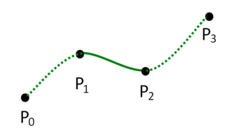

# Vývoj počítačových her

## Programování počítačových her

### vyvoj herních mechanik

- Cena x Benefit
- Zabavnost
- Intuitivnost

### herní návrhové vzory

- Singleton: jedna instance
- Factory: generator veci

### skriptování her

- Tweeny
- C#, python

## Architektura herních engine

### vrstvy architektur

### výpočetní modely

- Herni smyska
  - hracuv vstup
  - updatovat svet
    - posunout objekty
    - zkontrolovat kolize
    - upravit rychlosti a pozice
  - vyrenderovat svet
  - prehrat zvuky
  -

### entity-component system

Zpusob jak reprezentovat GameObjecty.
Objekt ma komponenty, kazda zarucujici nejakou funkcionalitu
Efektivnejsi pro pamet, protoze to je struct v zasobniku a ne classa na halde

- Entity: GameObject ID
- Komponenty: Data a komu patri
- Systemy: Spousti komponenty na entitach

### správa paměti

Je dulezite spravne vyuzivat cache
Tudiz je efektivnejsi mit data v zasobniku jako strukty, nez pohazene na halde

### příklady konkrétních instancí architektur

## Herní design

### kdo je herní designér

### osy herního designu

### herní žánry

### specifika herních platforem

### game design dokument

#### vlastnosti

#### struktura

#### UML diagramy pro popis herních mechanismů

#### herní prostor

#### postavy

#### specifikace dialogů

### historie herního trhu

## Vývojový cyklus počítačové hry

### fáze vývojového cyklu

### herní design řízený daty

### správa dat

### testování počítačových her

### vývojářské role

### herní analytiky

### vodopádový model a~agilní metodiky návrhu her

### obchodní modely komercializace her

## Narativita a~hry

### rozdíl mezi games of emergence a~games of progression

### chtěná a~nechtěná emergence

### environmentální storytelling

### procedurální rétorika

### ludonarativní disonance

# Počítačová grafika pro hry

## Pojmy

### Homogenní souřadnice

Homogenní souřadnice umožňují reprezentaci bodů a transformací v geometrickém prostoru s využitím matice vyšší dimenze.
Používají se pro sjednocení translací, rotací a škálování do jednoho matematického modelu.
Přidáním čtvrté souřadnice (w) do 3D prostoru umožňují snadnou aplikaci perspektivních projekcí.

Například bod [x, y, z] lze v homogenních souřadnicích zapsat jako [x, y, z, w], kde w ≠ 0.

### Afinní a projektivní transformace v rovině a v prostoru

Afinni \~ Ortogonalni

Afinní transformace zahrnují operace jako translace, rotace, škálování a šikmé posunutí, které zachovávají rovnoběžnost přímek.
Projektivní transformace rozšiřují afinní transformace o perspektivní zkreslení, což je klíčové pro modelování 3D scén.
Typický příklad projektivní transformace je pohledová projekce ve 3D grafice.

### Kvaterniony

Kvaterniony slouží k reprezentaci rotací ve 3D prostoru bez singularit spojených s Eulerovými úhly (gimbal lock).
Jsou čtyřrozměrným rozšířením komplexních čísel ve tvaru $q = w + xi + yj + zk$, kde $w$ je skalární část a $x, y, z$ jsou imaginární.
Jsou efektivní pro interpolaci rotací pomocí SLERP (Spherical Linear Interpolation).

## Křivky

### Spline funkce

Spline funkce jsou hladké křivky používané k aproximaci nebo interpolaci datových bodů.
Nevyhodou je, ze pokud se pohne 1 bodem, uz nebude spojita a musi se dorovnat vsechnny ostatni (kubicka varianta to nema).

### Interpolace kubickými spliny

Retez spojenych krivek.
Kubické spliny jsou specifické typy spline funkcí, které interpolují mezi body tak, aby byla zajištěna spojitost první a druhé derivace.

### Bézierovy křivky

Bézierovy křivky jsou definované kontrolními body a Bernsteinovými polynomy.
Umožňují tvorbu hladkých křivek a jsou klíčové v grafickém designu.

Linearni bezierovka: Lerp(A, B, t)
Kvadraticka bezierovka: Lerp(Lerp(A, B, t), Lerp(B, C, t), t)
Kubicka bezierovka: Lerp mezi 2 kvadratickymi bezierovkami

### Catmull-Rom spliny

Vychazi z Cubic Hermit spline.
2 body a 2 vektory (vstupni a vystupni)

### B-spliny

B-spliny jsou zobecněním Bézierových křivek, umožňují lokální kontrolu nad tvarem křivky.
Jsou vhodné pro modelování složitých tvarů v CAD systémech.

## Textury

### Vzorkování a kvantování obrazu

Vzorkování (Sampling) je proces získávání hodnot z textury (prectneni pixelu).

Kvantování omezuje počet úrovní intenzity, což snižuje náročnost na paměť.
Treba z realnych cisel na cisla diskretni.

### Anti-aliasing

Anti-aliasing redukuje zubaté okraje (aliasing) v obrazu.
Aplikuje se pouze na pixelech, jez obsahuje hranu 2 trojuhelniku.

Metody:

- MSAA (Multi-Sample Anti-Aliasing) - vicero vzorku pro jeden pixel (4, 8, 16 vzorku)
- SSAA (Super-Sample Anti-Aliasing) - Vicero pixelu pro 1 pixel (4, 16)
- FXAA (Post-processing) - vpodstate rozmaze / vyprumeruje pixely, ktere maji vysoky kontrast vuci okolnim pixelum

### Textury

Textury se používají k přidání detailů na povrch objektů.
Mohou být 2D, 3D, nebo procedurální.
Příkladem je texturování dřeva nebo kamene.

### Změna kontrastu a jasu

Manipulace kontrastu a jasu mění vzhled textury.
Tyto úpravy lze provést pomocí lineární transformace intenzity pixelů.

### Kompozice poloprůhledných obrázků

Při kompozici poloprůhledných obrázků se používá alfa kanál, který určuje průhlednost.
Kombinace barev probíhá například pomocí operace „over“ v alfa kompozici.

## Reprezentace 3D scén

### Výpočet viditelnosti

Určuje, které části scény jsou viditelné z určitého pohledu.
Metody

- Z-buffering (Depth textura / buffer) - Rasteriazace
- BSP stromy (Binary space partitioning) - Raytracing

### Výpočet vržených stínů

Vržené stíny přidávají hloubku do sceny.

Metody:

- shadow maping (svetlo renderuje hloubku do textury)
- path tracing (co pixel, to paprsek do svetla)

### Měkké stíny

Měkké stíny simulují přirozené rozmazání stínů, které vzniká díky rozptylu světla.

Metody:

- Raytracing to ma implicitne (pokud svetlo neni bod)
- Shadow maping se podivaji na pixely okolo (pixel filtering)

### Rozptyl světla pod povrchem

subsurface scattering.
Rozptyl světla pod povrchem simuluje průchod světla materiály, jako je kůže nebo voda.

### Modely osvětlení a stínovací algoritmy

Modely osvětlení (Phong, Blinn-Phong) a stínování (Gouraud, Phong) definují, jak se světlo šíří a odráží na povrchu.

- leskla slozka (specular)
- matna slozka (diffuse)
  - odrazova slozka (mirror)

### Rekurzivní sledování paprsku

Raytracing.
Simulace světelných cest zahrnující odrazy a refrakce.
Používá se ve filmové grafice, je pomala, ale realisticka.

### Fyzikální model šíření světla

#### Radiometrie

Studium fyzikálních vlastností světla, jako je intenzita, jas a energetický tok.

#### Zobrazovací rovnice

Zobrazovací rovnice (rendering equation) je klíčovým konceptem v radiometrii a počítačové grafice.
Popisuje, jak světlo interaguje s povrchy ve scéně a jak je výsledný obraz vytvořen.
Rovnice bere v úvahu všechny možné cesty světla, které přispívají k osvětlení daného bodu na povrchu.

Matematicky je zobrazovací rovnice vyjádřena jako:

$$L_o(x, \omega_o) = L_e(x, \omega_o) + \int_{\Omega} f_r(x, \omega_i, \omega_o) L_i(x, \omega_i) (\omega_i \cdot n) d\omega_i$$

neboli:
vysledna barva = emitovane svetlo + svetlo z odrazu (= rekurzivni BDRF $*$ svetla $*$ cosine law)

### Algoritmus sledování cest

Path tracing je pokročilá metoda simulující globální osvětlení.
Pro kazdy pixel se vysle nekolik paprsku.
Kazdy paprsek se odrazi po scene, dokud nenarazi na svetlo, nebo neskonci po X krocich.

### Předpočítané globální osvětlení

Techniky jako lightmaps ukládají výsledky osvětlení pro rychlejší vykreslování.
napr. WOWko.
Svetlo se zapece pri kompilaci hry, nebo za runtimu a pak se jakoby cache hodnota pouziva.
Umoznuje pokrocile stiny a barvy, ale je to vse staticke.

### Výpočet globálního osvětlení v reálném čase

Real-time GI zahrnuje techniky jako voxel cone tracing nebo ray tracing na GPU.

### Stínování založené na sférických harmonických funkcích

Radiosita vuci environment mape.
Je to vlastne diffuzni slozka environment mapy.

### Předpočítaný přenos radiance

Predpocitani env mapy pres sfericke harmonicke funkce do paaraametru rovnice.
Staci ji mit jako rovnici a parametry, textura by byla moc velka a ochylka je < 3%.

## Animace postav

### Skinning

Skinning váže geometrii na kostru.
Lineární blend skinning je běžný algoritmus používaný ve hrách.

### Rigging

Rigging zahrnuje tvorbu kostry a kontrolních mechanismů pro animaci postavy.

### Morphing

Morphing interpoluje mezi různými tvary nebo animacemi.

## Architektura grafického akcelerátoru

### Předávání dat do GPU

Data jako vertex buffery a textury jsou přenášena z CPU do GPU pomocí API jako OpenGL nebo DirectX.

### Textury a GPU buffery

Textury a buffery jsou optimalizovány pro rychlý přístup během vykreslování.

### Programování GPU shaderů

Shadery jsou malé programy běžící na GPU, které ovlivňují vzhled scény.

## Jazyky

### OpenGL

OpenGL je grafická API umožňující programování 2D a 3D grafiky.

### GLSL

GLSL je jazyk pro psaní shaderů v OpenGL.

### CUDA

CUDA je platforma pro paralelní programování na GPU, využívající výpočetní schopnosti grafické karty.

### OpenCL

OpenCL je standard pro paralelní výpočty na různých typech hardwaru.

## Komprese

### Principy komprese rastrové 2D grafiky

Redukce velikosti obrazových dat odstraněním redundantních informací.
Bezeztrátová komprese zachovává původní obraz, ztrátová redukuje kvalitu.

### Standard JPEG

JPEG je ztrátový kompresní formát, který využívá DCT (diskrétní kosinovou transformaci) a quantizaci (v zavislosti na urovni DCT) na submatici 8x8.

### Komprese videosignálu

Využívá prostorovou i časovou redundanci pro efektivní ukládání videa.
Vyuziva DCT, pohybove vektory a quantizaci (v zavislosti na urovni DCT).
Sniky jsou 3 typu:

- I = plny snimek
- P = rozdil mezi poslednim I nebo P snimkem
- B = rozdil snimku pred a snimku po
  v pomeru napr. 2:5:12

Příkladem je H.264 nebo H.265.

# Umělá inteligence pro počítačové hry

## Architektura autonomního agenta

### percepce

### mechanismus výběru akcí

### paměť

## psychologické inspirace.

## Metody pro řízení agentů

### symbolické a~konekcionistické reaktivní plánování

### hybridní přístupy

### prostor rozhodování

### if-then pravidla

### skriptování

### sekvenční konečný automat

### stromy chování

## Problém hledání cesty

### lokální navigační pravidla (Raynoldsovy steeringy, VO, RVO, Context steering)

### hledání cesty (A*, JPS+, goal bounding, RRT, RRT*, LPA*, MPAA*, obousměrné prohledávání)

### reprezentace prostoru (geometrie, viditelnost)

## Komunikace a~znalosti v~multiagentních systémech

### ontologie

### řečové akty

### FIPA-ACL

### protokoly

## Distribuované řešení problémů

### kooperace

### Nashova ekvilibria

### Paretova efektivita

### alokace zdrojů

### aukce

## Metody pro učení agentů

### zpětnovazební učení

### základní formy učení zvířat

## Procedurální modelování stavového prostoru (forward model) a~jeho prohledávání

### A\*

### ABCD

### MCTS

### UCB

### PGS

### PGS-II

### prostor skriptů

#### Kiting

#### AV

#### NOK-AV

### efektivní implementace

## Klasifikace metod procedurálního generování

## Přístupy pro generování

### terénu

### vizuálních efektů

### hudby

### předmětů

### bludišť

### dungeonů

## Šumové funkce

### Perlin

### Simplex

### Worley

## Celulární automaty

### L-systémy

### grafové

### tvarové gramatiky

## Answer set programming

## Algoritmus kolapsu vlnové funkce

## Metody smíšené iniciativy
