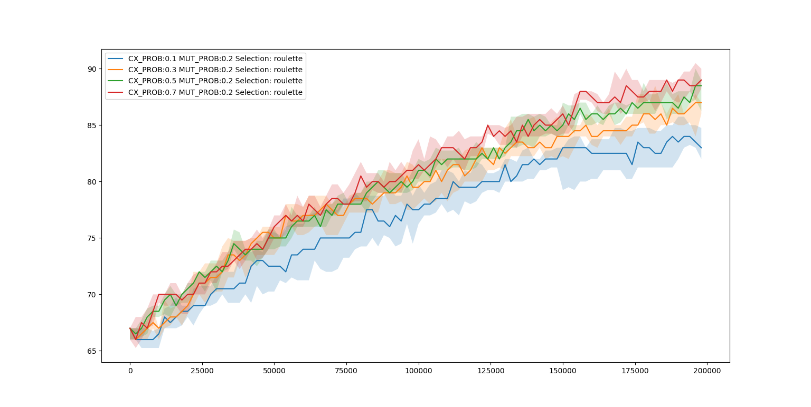
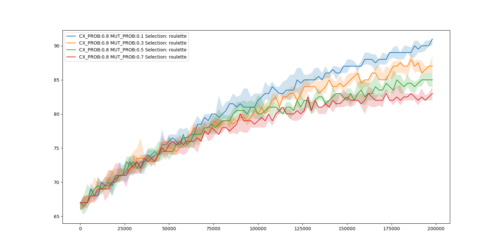
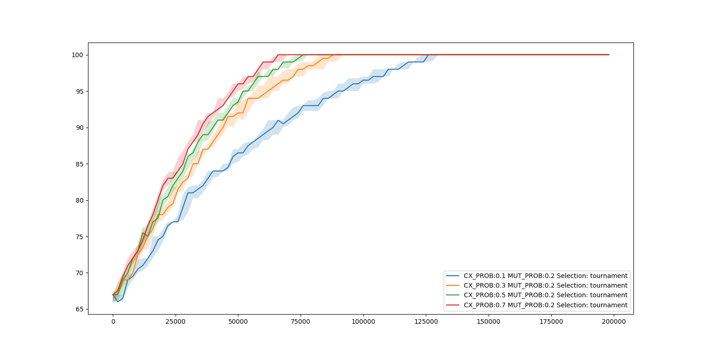
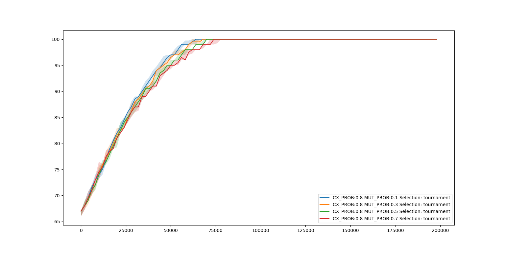
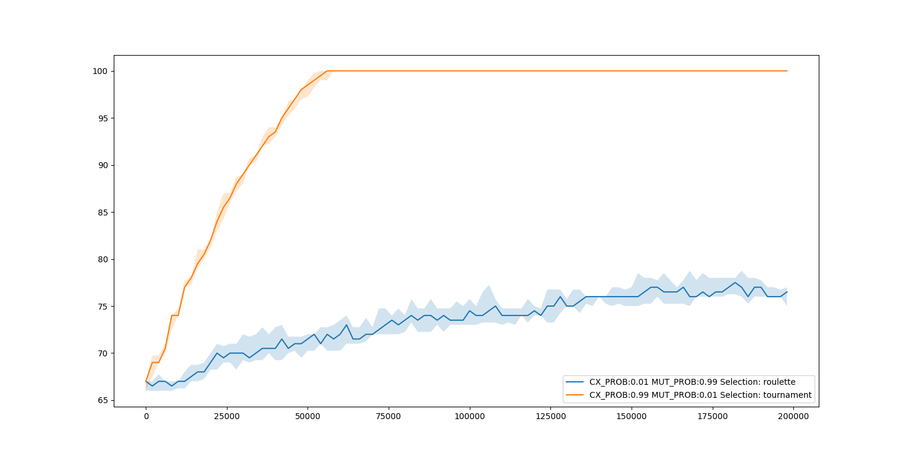

~David~ ~Napravnik~

-----
# 1. HW Jednoduchý genetický algoritmus

#### 3. Upravte algoritmus (fitness funkci) tak, aby vyvíjel jedince, kde se střídají 1 a 0
``` python
def fitness(ind):
	return sum([1-g if i % 2 == 0 else g for i, g in enumerate(ind)])
```

#### 4. Zkuste změnit některé parametry algoritmu (např. pravděpodobnost mutace nebo křížení) a podívejte se, co se stane.

**Pozorovani**
- Turnajova selekce je znatelne lepsi nez ruletova selekce
- Vyssi pravdepodobnost krizeni jedincu ma lepsi vysledky
- Vyssi pravdepodobnost mutace naopak ma vysledky horsi 


#### 5. Pošlete graf, který srovnává konvergenci algoritmu pro různá nastavení operátorů.

**Nastaveni evoluce**
- Jedincu v populaci: 2000
- Delka jedince: 100
- Pocet generaci: 100
- Pravdepodobnost mutace casti jedince: 1 / delka jedince
- Opakovani: 10

##### Selekce
Porovnani dvou typu selekci


##### Ruletova selekce
Zavislost evoluce na pravdepodobnosti zkrizeni jedincu


Zavislost evoluce na pravdepodobnosti mutace


##### Turnajova selekce
Zavislost evoluce na pravdepodobnosti zkrizeni jedincu 

Zavislost evoluce na pravdepodobnosti mutace


#### 6. Napište mi, co vše jste zkusili.

Porovnal jsem vsechny parametry mezi sebou a to pres dva ruzne typy selekce.

Grafy jsou nekolikatou iteraci podle velikosti populace, delky behu i dalsich nastaveni tak, aby byly prehledne a snadno porovnatelne.

Uchovani nejlepsiho jedince stejne jako uchovani lepsi poloviny populace neprineslo zadne zlepseni (v turnajove selekci)

Na zaver graf porovnavajici nejlepsi a nejhorsi evolucni parametry

