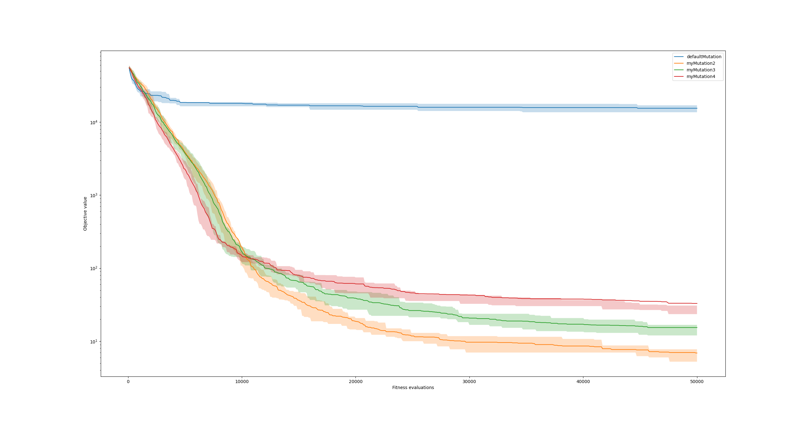

~David~ ~Napravnik~

---

# 2. HW Partition

#### 1.
**Vyzkousene selekce**:
- roulette_wheel_selection
- sus_selection
- tournament_selection

**vylepsena mutace a selekce**

vylepsene parametry znamena mensi populace, vice generaci, stejne fitness evaluaci.

**Nejlepsi behy**:
| |Easy|Hard|
|--|--|--|
| Rozdil | 0 | 1 |

V priloze i oba *.best

#### 2.
Jako lepsi mutaci jsem prehazoval pozici 2 itemu v batohu navzajem.
Jeste jsem zkousel prohazovat vice veci, ale prohodit 2 je nejefektivnejsi (nejmin veci se rozbije).
``` python
def swap_mutate2(p, prob, upper):
    item1 = random.randrange(0,len(p)-1);
    item2 = random.randrange(0,len(p)-1);
    tmp = p[item1]
    p[item1] = p[item2]
    p[item2] = tmp
    return p
```


**Dalsi vylepseni**
Jeste jsem zkousel u turnajove selekce vzit vice souperu a z nich vybrat nejlepsiho.
neni to velka zmena, ale vice souperu je lepsi, rozumne mnozstvi se kterym jsem pokracoval bylo 5.


