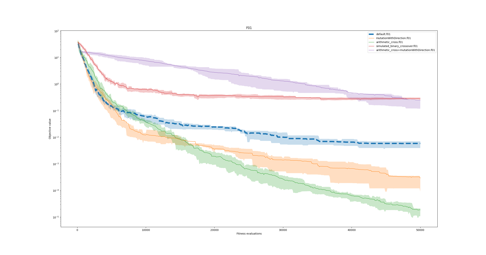
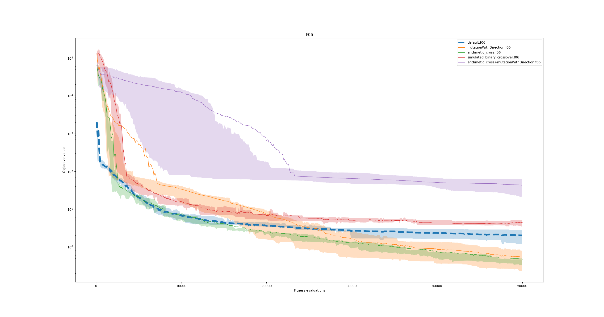
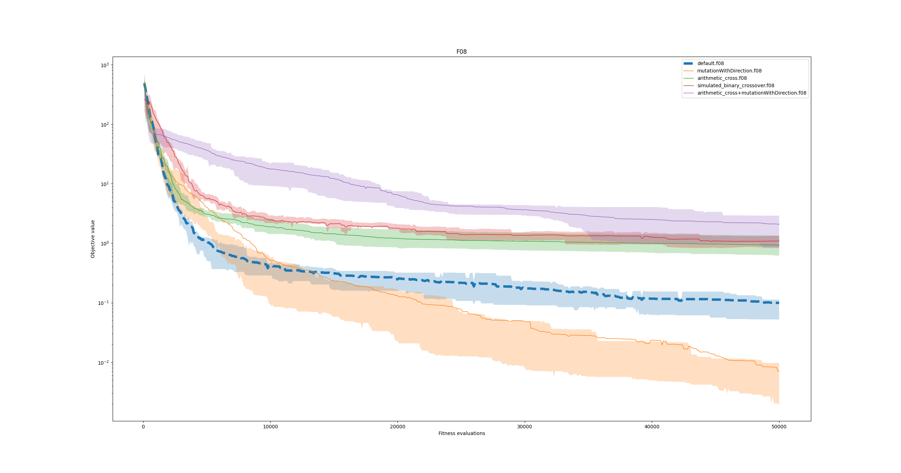
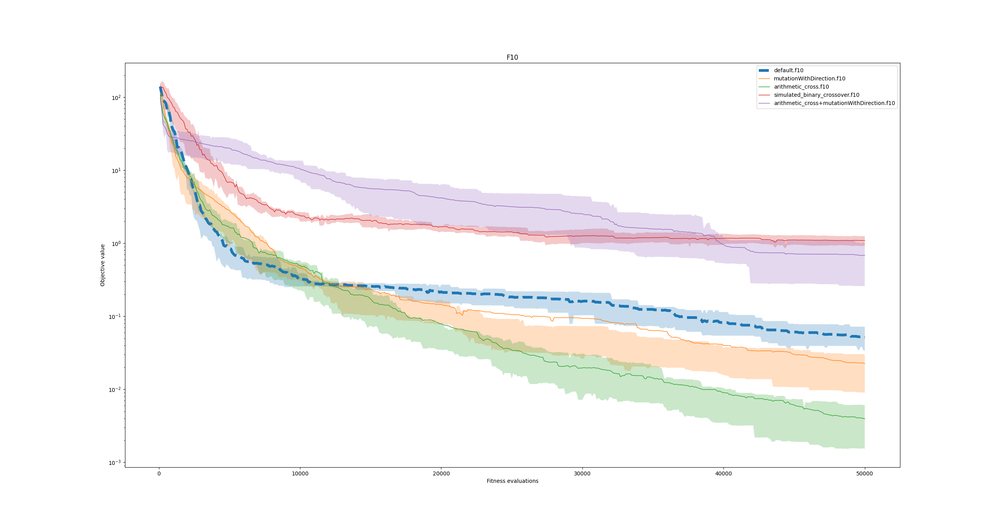

~David~ ~Napravnik~

---

# 3. HW CO + LB

## Zmenene operatory
### Arithmetic crossover
```python
def arithmetic_cross(p1, p2):
    alpha = random.random()
    o1 = alpha * p1 + (1 - alpha) * p2
    o2 = alpha * p2 + (1 - alpha) * p1
    return o1, o2
```

### Simulated binary crossover
Tady jsem nastavoval vsechni mozne jako eta, ale nic nefungovalo a *generace + 20* fungovala nejlepe, i kdyz stale byla horsi nez *arithmetic crossover*
```python
def simulated_binary_crossover(p1, p2, generation):
    eta = 20 + generation
    o1 = p1[::]
    o2 = p2[::]
    for i, (x1, x2) in enumerate(zip(p1, p2)):
        rand = random.random()
        if rand <= 0.5:
            beta = 2. * rand
        else:
            beta = 1. / (2. * (1. - rand))
        beta **= 1. / (eta + 1.)
        o1[i] = 0.5 * (((1 + beta) * x1) + ((1 - beta) * x2))
        o2[i] = 0.5 * (((1 - beta) * x1) + ((1 + beta) * x2))
    return o1, o2
```


### Mutace 
Nahodny smer je ovlivnen vektorem s nahodnym jinym clenem populace

```python
def __call__(self, ind, pop):
	random_ind = pop[np.random.randint(0, len(pop))]
	direction_vector = random_ind - ind
	if np.all(direction_vector == 0):
		direction_vector = np.random.normal(size=ind.shape)
	direction_vector /= np.linalg.norm(direction_vector)
	return ind + self.step_size * direction_vector
```


## Grafy
Ackoliv se *arithmetic crossover* i mutacce chovali samostatne skvele, tak jejich kombinace, az tak skvele nedopadla.







