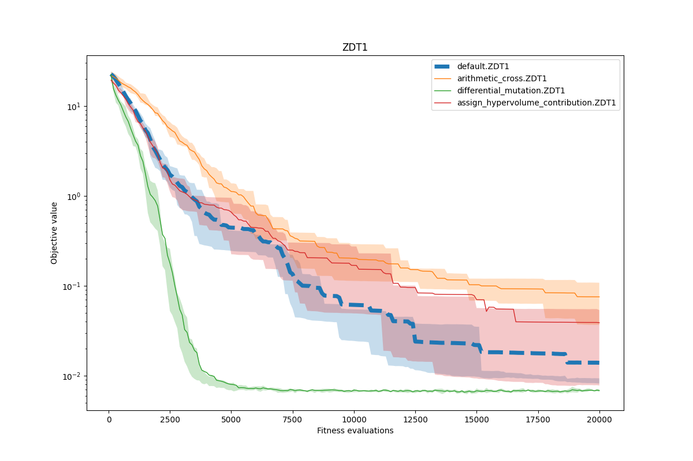
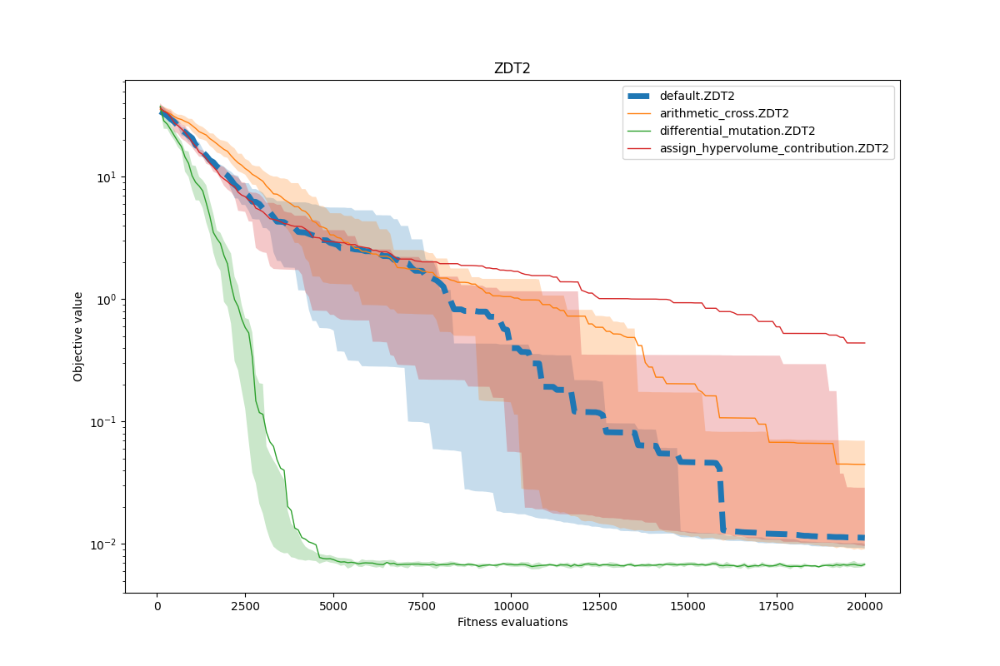
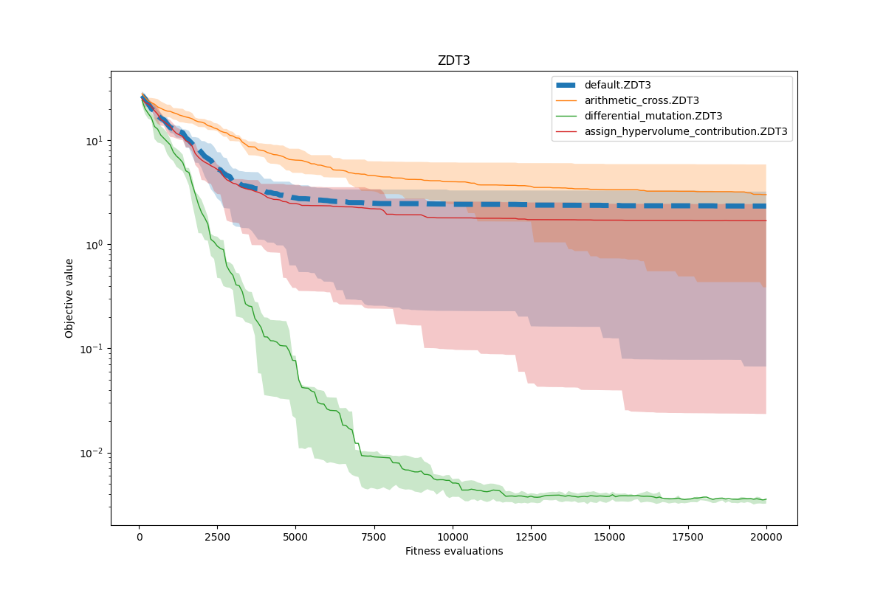
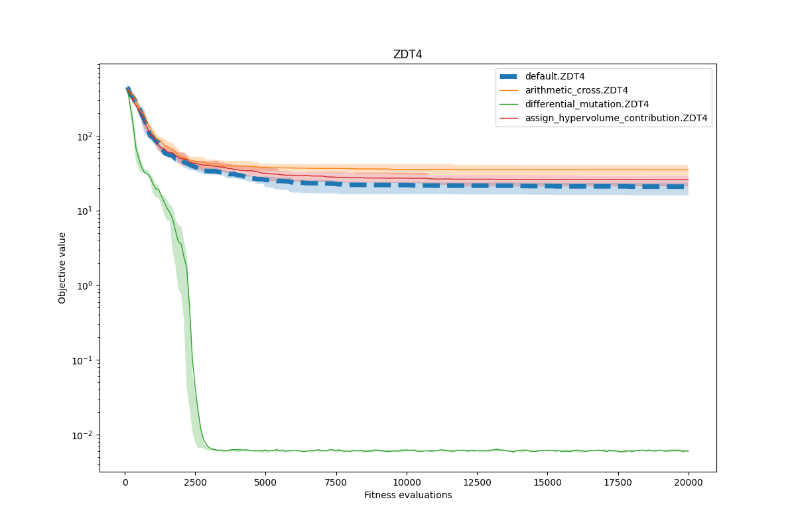
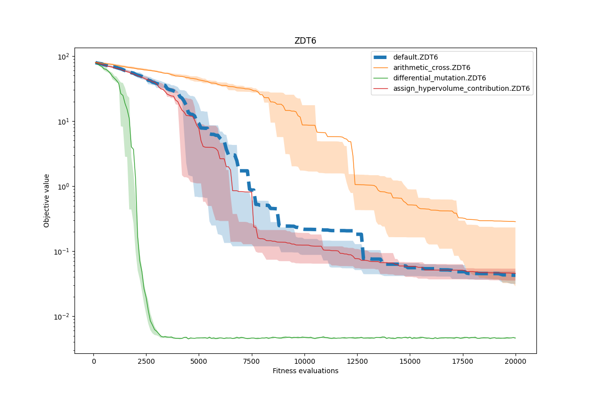

David Napravnik

---

# 4. HW MOO

## Co jsem zkusil a jak to dopadlo

Vyzkousel jsem **aritmeticky crossover** z minula, ten bohuzel nebyl lepsi nez defaultni reseni.

Dale jsem na to nasadil **diferencialni mutaci** z minula, ta byla velmi uspesna a primarne na zacatku evoluce velmi efektivni.

A nakonec jsem vymenil *assign_crowding_distances* za **assign_hypervolume_contribution**, ktery nekde prilepsil, nekde prihorsil.
Primarne ale jeho pridanim se velmi snizila rychlost programu (cca 100x).

Takze stale za me **vyhrava diferencialni evoluce**, ktera je rychla a navic lepe konverguje.

Nize jsou pouzite **zdrojaky** a **grafy**.


## Code

```python
class Differential_Mutation:
    def __init__(self, step_size):
        self.step_size = step_size
        self.CR = 0.9
        self.F = 0.8
    def __call__(self, ind, pop):
        x_index = pop.index(ind)
        while True:
            companions = [random.randrange(0, POP_SIZE) for _ in range(3)]
            [a, b, c] = companions
            companions.append(x_index)
            unique = len(set(companions)) == 4
            if unique:
                break
        randomIndex = random.randrange(0, DIMENSION)
        y = copy.deepcopy(ind)
        [a, b, c] = [pop[a], pop[b], pop[c]]
        for i in range(DIMENSION):
            if i == randomIndex or random.random() < self.CR:
                y.x[i] = a.x[i] + self.F * (b.x[i] - c.x[i])
            else:
                y.x[i] = ind.x[i]
        np.clip(y.x, 0, 1, y.x)
        return y
```

```python
def arithmetic_cross(p1, p2):
    alpha = random.random()
    p1 = copy.deepcopy(p1)
    p2 = copy.deepcopy(p2)
    o1 = alpha * p1.x + (1 - alpha) * p2.x
    o2 = alpha * p2.x + (1 - alpha) * p1.x
    p1.x = o1
    p2.x = o2
    return p1, p2
```

```python
def assign_hypervolume_contribution(front):
    front = list(sorted(front, key=operator.attrgetter('fitness')))
    if len(front) < 3:
        front[0].ssc = np.inf
        front[-1].ssc = np.inf
    else:
        for i in range(0, len(front)):
            front[i].ssc = hypervolume(front) - hypervolume(front[:i] + front[i + 1:])
```

## Grafy

Behy jsem spoustel 10x a pocet **generaci zvysil na 200**.






