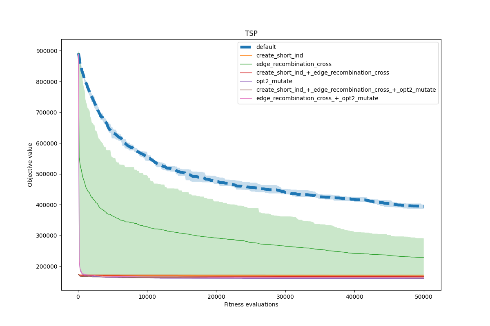

David Napravnik

---

# 5. HW TSP

## Co jsem zkusil a jak to dopadlo
- Vytvareni jedince hladovym algoritmem (`create_short_ind`)
  - prvni mesto je nahodne
  - pridavame nejblizsi zatim nenavstivene mesto
- Vlatni crossover (`edge_recombination_cross`)
- Chytra heuristika / mutace (`opt2_mutate`)

- # todo nejlepsi beh


## Code

```python
def create_short_ind(ind_len, cities):
    ind = [-1 for _ in range(ind_len)]
    ind[0] = random.randrange(0, ind_len)
    for i in range(1, ind_len):
        shortestIndex = -1
        shortestValue = 1e6
        for j in range(ind_len):
            if j not in ind:
                dist = distance(cities[ind[i-1]], cities[j])
                if dist < shortestValue:
                    shortestIndex = j
                    shortestValue = dist
        ind[i] = shortestIndex
    return ind
```

```python
def edge_recombination_cross(p1, p2):
    neighbor_list = {}
    for i, _ in enumerate(p1):
        neighbor_list[p1[i]] = set()
        neighbor_list[p2[i]] = set()
    for i, _ in enumerate(p1):
        neighbor_list[p1[i]].add(p1[(i + 1) % len(p1)])
        neighbor_list[p1[i]].add(p1[(i - 1) % len(p1)])
        neighbor_list[p2[i]].add(p2[(i + 1) % len(p2)])
        neighbor_list[p2[i]].add(p2[(i - 1) % len(p2)])
    child = []
    x = random.choice([p1[0], p2[0]])
    child.append(x)
    for node in neighbor_list:
        neighbor_list[node].discard(x)
    while len(child) < len(p1):
        if not neighbor_list[x]:
            z = random.choice([node for node in neighbor_list if node not in child])
        else:
            min_neighbors = min(len(neighbor_list[node]) for node in neighbor_list[x])
            neighbors_with_min = [node for node in neighbor_list[x] if len(neighbor_list[node]) == min_neighbors]
            z = random.choice(neighbors_with_min)
        child.append(z)
        for node in neighbor_list:
            neighbor_list[node].discard(z)
        x = z
    return [child, child]
```

```python
def opt2_mutate(p, max_len, cities):
    o = p[:]
    found_improvement = False
    n = len(p)
    for i in range(n - 1):
        for j in range(i + 1, n):
            length_delta = -distance(cities[o[i]], cities[o[(i + 1) % n]])
            length_delta -= distance(cities[o[j]], cities[o[(j + 1) % n]])
            length_delta += distance(cities[o[i]], cities[o[j]])
            length_delta += distance(cities[o[(i + 1) % n]], cities[o[(j + 1) % n]])
            if length_delta < 0:
                o[i+1:j+1] = reversed(o[i+1:j+1])
                found_improvement = True
    if found_improvement:
        return o
    else:
        return swap_mutate(p, max_len, cities)
```

## Grafy


And zoom on bottom part:


