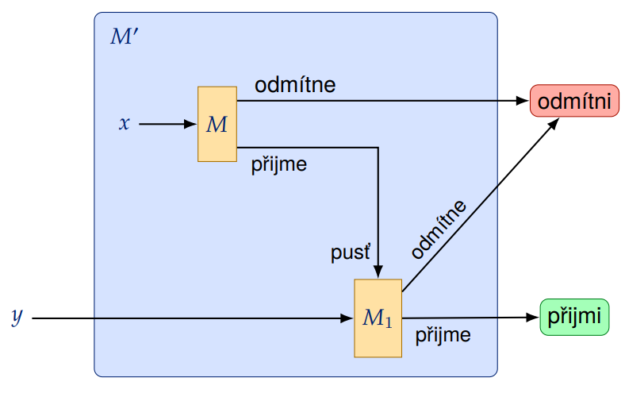
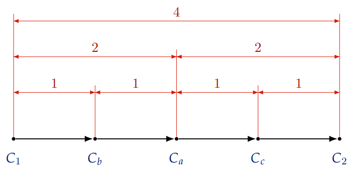
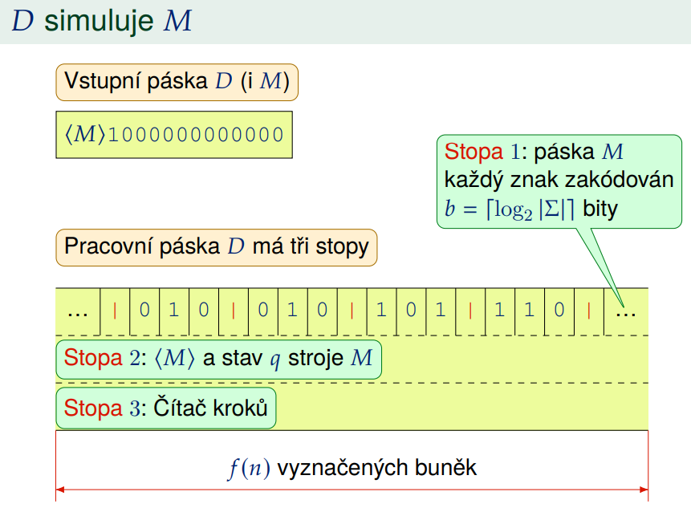
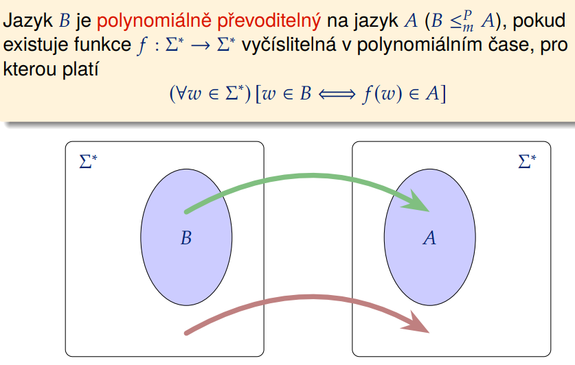
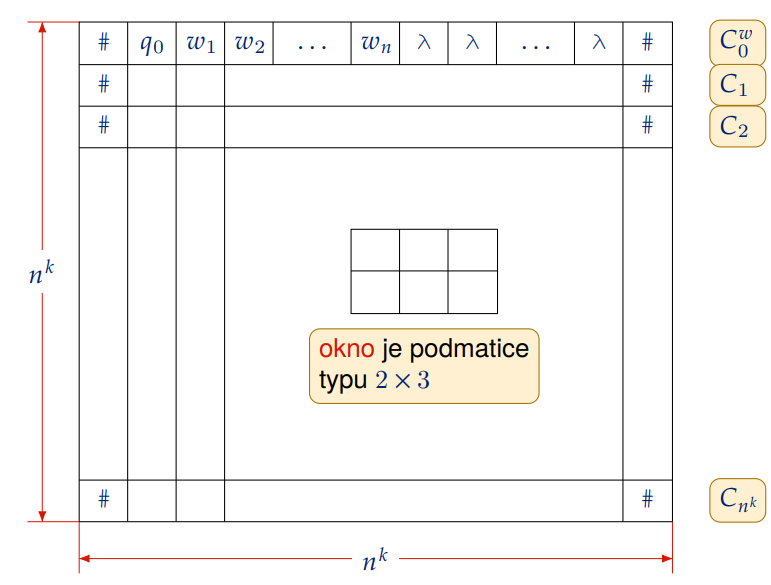
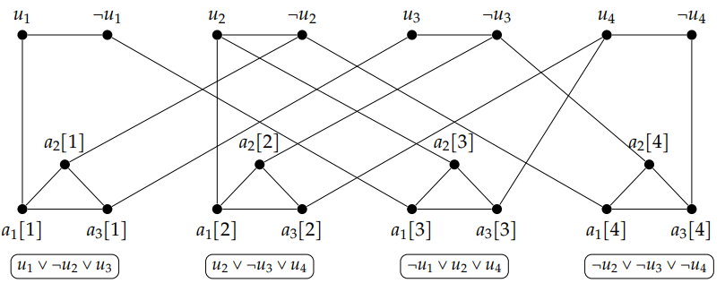

## 🟣 A1 Riceova veta, dukaz pomoci m-prevoditelnosti:

Necht C je trida **castecne rozhodnutelnych jazyku**. Potom jazyk $L_C=\{\langle M\rangle |L(M)\in C\}$
je **rozhodnutelny**, prave kdyz je trida $C$ **trivialni**, tj. bud je prazdna, nebo obsahuje vsechny castecne rozhodnutelne jazyky.

### Dukaz

prava implikace:

- Necht trida $C$ je prazdna
  - $L_C$ je rozhodnutelny
- Necht trida $C$ obsahuje vsechny castecne rozhodnutelne jazyky
  - $L_C$ je rozhodnutelny

leva implikace

- Predpoklad: $C$ je netrivialni
- Ukazeme ze $L_u \leq_m L_C$ pokud $C$ neobsahuje prazdny jazyk
- Ukazeme ze $L_u \leq_m \overline{L_C}$ pokud $C$ obsahuje prazdny jazyk
- Pro $C$ bez prazdneho jazyka:
  - Mejme TM $M_1$ takovy ze $L(M_1) \in C$
  - Sestrojime TM M':
    - prijmi pokud $M(x)$ a $M_1(y)$ prijimaji jinak neprijimej
- Ukazeme na $x \in L(M)$ a $x \notin L(M)$ ze to funguje
- Dostavame $L_u \leq_m L_C$

## 🟣 A2 Savicova veta:

pro kazdou funkci $f(n)\geq \log_2 n$ plati, ze $NSPACE(f(n))\subseteq SPACE(f^2(n))$

### Dukaz

- Mejme jazyk $L\in NSPACE(f(n))$
- Existuje NTS $M$, ktery prijima $L$ v prostoru $O(f(n))$
- Popiseme DTS $M'$, ktery rozhoduje L v prostoru $O(f^2(n))$
- Idea:
  - Se vstupem $x$, hledej cestu z pocatku do prijimajiciho stavu v grafu $G_{M,x} = (V,E)$
- Rozdel a panuj:
  - hledame cestu z $C_1$ do $C_2$ pres $C_m$, ta bude dlouha max $O(f(n))$
  - rekurzivne hledame cestu polovicni delky, az dokud neni delka nulova.
  - pocet ruznych vrcholu $C_m$ je $O(f(n))$
- Celkove $O(f^2(n))$
- a prostorove nam staci $O(f(n))$
- Je-li $f(n)$ neznama tak zkousime $1, 2, 3 ... i$ dokud tu cestu nenajdeme.

## 🟣 A3 Deterministická prostorová hierarchie:

Pro kazdou prostorove konstruovatelnou funkci $f:N->N$ existuje jazyk A, ktery je rozhodnutelny v prostoru $O(f(n))$ nikoli vsak v prostoru $o(f(n))$.

### Dukaz

- $A$ definujeme popsanim stroje $D$, ktery rozhoduje $A$
- $D$ pracuje v prostoru $O(f(n))$
- Pro kazdy stroj $M$, ktery pracuje v prostoru $o(f(n))$ plati, ze $L(M) \neq L(D)$
- Ukazeme ze neexistuje T', ktery by prijimal stejny jazyk v $o(f(n))$
- Vyuzijeme diagonalizaci
- Konstrukce D
  - Simuluj $M(⟨M⟩)$ v prostoru $f(n)$ s pocitanim kroku
  - Pokud $M$ zastavi a odmitne, tak prijmi, jinak odmitni
  - Retezec musi byt vsech delek $⟨M⟩10^*$
  - vstup $x = ⟨M⟩10^{n_0}$
  - prostor $f(n)$ staci k simulaci $M(x)$
  - $D(x)$ prijme, prave kdyz $M(x)$ odmitne
  - Tedy $L(M) \neq L(D)$
  - problem zastaveni: zastav pokud simulace vyzaduje vice nez $2^{f(n)}$
- $g(n) = o(f(n)) => (\exist n_0 \in N)(\forall n \geq n_0)[c_M g(n)\leq f(n)]$
- existuji konstanty $c_M$ a $n_0$, takove ze se vstupem $x$ delky $n \geq n_0$
  - $M(x)$ lze simulovat v prostoru $c_M g(n) \leq f(n)$
  - $M(x)$ skonci vypocet do $2^{C_Mg(n)} \leq 2^{f(n)}$ kroku
- $L(D) \neq L(M)$

## 🟣 A4 Deterministická časová hierarchie:

Pro kazdou casove konstruovatelnou funkci $f:N->N$ existuje jazyk $A$, ktery je rozhodnutelny v case $O(f(n))$, nikoli vsak v case $o(\frac{f(n)}{log f(n)})$

### Dukaz

- podobne jako v pripade prostoru
- je potreba simulovat $M(x)$ s pocitanim kroku
- TM musi mit jednu pasku
- Definujeme $A=L(D)$
- instrukce $M(x)$ musi trvat maximalne $c_M$ kroku simulace
- snizujeme pocitadlo o 1 po kazdem kroku D v case $O(\log f(n))$
- vstup x tvaru $⟨M⟩10^*$
- pridame dalsi 2 pasky
  - 2.paska ma aktualni stav vypoctu
  - 3.paska je binarni pocitadlo a je zarovnana s hlavou
    - to udela v case $O(\log(f(n)))$
- Dohromady zabere $O(f(n))$ kroku na simulaci $M(x)$ a manipulaci s citacem
- Sporem
  - predpokladame ze takovy stroj existuje
  - Skrz simulaci na stroji N se odvodi spor a tedy takovy stroj $M$ existovat nemuze

## 🟣 A5 Cookova-Levinova věta (NP-úplnost SAT):

Problem SAT je NP-uplny.

NP-uplny = NP & NP-tezky
NP-tezky = pokud kazdy jazyk A v NP je polynomialne prevoditelny na B

### Dukaz

- Zavedeme definici polynomiani prevoditelnosti
- Ukazeme ze SAT patri do NP
  - Pomoci polynomialniho verifikatoru $V(\phi, a)$
  - overi ze ohodnoceni a splnuje $\phi$
- Ukazeme ze je NP-tezky
  - $A$ je prijiman nejakym NTM $M$ v polynomilanim case
  - Modely $\phi$ popisuji prijimajici vypocty $M$ nad $w$

---

## 🟣 B1 Univerzální Turingův stroj a nerozhodnutelnost jazyka univerzálního Turingova stroje:

### Univerzální Turingův stroj

Univerzalni Turinguv stroj je $U$
Vstupem je retezec $\langle M,x\rangle$, kde $M$ je Turinguv stroj a $x$ je binarni retezec.
$U$ simuluje praci $T$M nad vstupem $x$.
$U(⟨M,x⟩)↓$ prave kdyz $M(x)↓$ a $U(⟨M,x⟩)$ prijme prave kdyz $M(x)$ prijme.

### Nerozhodnutelnost jazyka

- univerzalni jazyk
  - $L_u = {⟨M, x⟩ ∣ x \in L(M)}$
- pouzijeme diagonalizaci
  - radky jsou jazyky $L(m_i)$
  - sloupce jsou binarni slova $w_i$
- sestrojime diagonalni vektor, takovy ze nebude castecne rozhodnutelny (jinak by jeho radek v matici byl)

## 🟣 B2 RAM a ekvivalence s Turingovým strojem:

### RAM

- sklada se z
  - CPU prijimajici instrujce $I$ (LOAD, ADD, COPY, PRINT ...)
  - Neomezene pameti rozdelene do registru $r_0, ..., r_i$

### Ekvivalence

- Nechť $L \sube Σ^*$ je jazyk a $f:\sum^* -> \sum^*$ je retezcova funkce.
- Potom plati:
  - Jazyk L je prijimany nejakym TM M, prave kdyz je prijimany nejakym RAM R.
  - Funkce $f$ je turingovsky vycislitelna, prave kdyz je RAM vycislitelna.

### Dukaz

- Turinguv stroj => RAM
  - prechodova funkce na `if (stav == X & cteme = Y) then`
- RAM => Turinguv stroj
  - 4 pasky (vstup, vystup, pamet, mezivysledky)
  - instrukce RAMu jsou jen binarni retezce

## 🟣 B3 Vlastnosti (Turingovsky) rozhodnutelných a částečně rozhodnutelných jazyků (uzávěrové vlastnosti, Postova věta, enumeratory):

### Obecne

- jsou-li $L_1$ a $L_2$ (cast.) rozhodnutelne
- pak i $L_1 \cup L_2, L_1 \cap L_2, L_1\cdot L_2, L_1^*$ jsou (cast.) rozhodnutelne

### Rozhodnutelný

- $L$ je rozhodnutelne, pokud existuje $M$, ktery jej prijima $(L=L(M))$ a zastavi se s kazdym vstupem $x$

### Částečně rozhodnutelný

- $L$ je castecne rozhodnutelne, pokud existuje $M$, ktery jej prijima $(L=L(M))$

### Postova veta

- Jazyk $L$ je rozhodnutelny prave kdyz $L$ i $\overline{L}$ jsou castecne rozhodnutelne jazyky

### Enumeratory

- Jazyk $L$ je částečně rozhodnutelný, právě když pro něj existuje enumerátor $E$.
- Jazyk $L$ je rozhodnutelný, právě když pro něj existuje enumerátor $E$, který navíc vypisuje prvky $L$ v lexikografickém pořadí.

## 🟣 B4 Definice zakladnich trid slozitosti a dukaz NTIME(f(n)) $\subseteq$ SPACE(f(n)):

- Necht $f:N->N$
- **TIME(f(n))**: Jazyk $L\sube \sum^*$ patri do $TIME(f(n))$ prave kdyz existuje DTM ktery jazyk L rozhoduje v case $O(f(n))$
- **SPACE(f(n))**: Jazyk $L\sube \sum^*$ patri do $TIME(f(n))$ prave kdyz existuje NTM ktery jazyk L rozhoduje v prostoru $O(f(n))$
- **NTIME(f(n))**: Jazyk $L\sube \sum^*$ patri do $TIME(f(n))$ prave kdyz existuje DTM ktery jazyk L rozhoduje v case $O(f(n))$
- **NSPACE(f(n))**: Jazyk $L\sube \sum^*$ patri do $TIME(f(n))$ prave kdyz existuje NTM ktery jazyk L rozhoduje v prostoru $O(f(n))$

### Dukaz

- Mejme jazyk $L \in NTIME(f(n))$ a NTM M, ktery jazyk $L$ prijima v case $O(f(n))$
- Vytvorime jednopaskovy M' prevodem z tripaskoveho DTM M''
- prostor se zvetsuje jen konstantne nasobne s poctem pasek

## 🟣 B5 Definice zakladnich trid slozitosti a dukaz vety o vztahu prostoru a casu

=||= B4

- $\forall L \in NSPACE(f(n)) => (\exist c_L \in N)[L \in TIME(2^{c_Lf(n)})]$:

### Dukaz

- Mejme $L \in NSPACE(f(n))$ a NTM M prijimajici jazyk $L$ v prostoru $O(f(n))$
- Vyrobme DTM M' jakozto hledani cesty v grafu (cesta existuje == prijima $x$)
- Plati ze L(M') = L(M) = L
- M' pracuje v case $2^{C_Mf(n)}$, pro konstantu $C_M$ zavisici na implementaci
- Pokud nemuzeme $f(n)$ vycislit, tak:
  - Generujeme graf za behu
  - Pokud najdeme cil prijmeme
  - Pokud nemuzeme generovat graf tak neprijmeme

## 🟣 B6 Dvě definice třídy NP a jejich ekvivalence:

- NP je mnozina rozhodovacich problemu, resitelna v polynomialnim case NTM
- NP je mnozina rozhodovacich problemu, overitelna v polynomialnim case DTM

## 🟣 B7 Polynomialní převod SAT na 3-SAT:

- Necht $\alpha$ je formule v KNF
- Vytvarime $\beta$ takovou, ze ma 3 literaly v kazde klauzuli
- chceme $\alpha$ je splnitelna <=> $\beta$ je splnitelna
- Kazdou klauzuli $A_i$ z $A_1 \wedge ... \wedge A_m $
  - tvaru $A_i = (a_1 \vee ... \vee a_k)$
  - pokud pocet literalu je 1: vytvorme 4 klauzule (a00, a01, a10, a11)
  - pokud je 2 tak (ab0, ab1)
  - pokud 3 tak (abc)
  - pokud > 3: pridame promene a stavime bloky po 3
    - (ab1, 0c1, 0d1, 0e1, 0fg) ... spojujeme je stejnymi literaly jen v negaci
- Dokazat splnitelnost vsech pripadu

## 🟣 B8 Polynomialní převod 3-SAT na Vrcholové pokrytí:

- klauzule jsou trojuhelniky dole
- literaly spojene po dvojicich
- propojeni mezi klauzulemi a literaly
  

## 🟣 B9 Definice třídy FPT a kernelu a jejich souvislost. Kernelizace Vrcholového pokrytí:

- Parametrizovany problem $L \sube \sum^* \times N$ je FPT (resitelny s pevnym parametrem)
- prave kdyz jej lze rozhodnout algoritmem $\alpha$ kteru pracuje v case $O(f(k)\cdot |I|^c)$

- A je kernel pro problem L, pokud
  - A pracuje v polynomialnim case
  - Pro instance $⟨I,k⟩$ a $⟨I', k'⟩ = A(I,k)$ plati: $⟨I,k⟩\in L$
  - existuje vycislitelna funkce $g(k)$ takova, ze pro kazde instance $⟨I, k⟩$ a $⟨I', k'⟩ = A(I, k)$ plati $|I'|+k \leq g(k)$

🔴 todo

## 🟣 B10 Definice třídy FPT a parametrizovaný algoritmus pro Vrcholové pokrytí založený na prohledávání s omezenou hloubkou (se složitostí menší než $O^*(2^k)$).

=||=

- parametrem dokazeme orezat velikost problemu
- zvolme $k$ takove, ze pokud vrcholove pokryti existuje, bude velikosti maximalne $k$
- dokazeme v $O(1.28^k +kn)$

## 🟣 B11 Třída #P a #P-úplnost, důkaz těžkosti počítání cyklů v grafu.

- funkce $f:\sum^* => N$ patri do tridy #P, pokud existuje polynom $p$ a polynomialni verifikator $V$ takove ze
- $\forall x \in \sum^*$ plati: $f(x) = ∣\{y ∣ ∣y∣ ≤ p(∣x∣) \text{a} V(x, y) \text{ prijme } \}∣$
  .
- Funkce $f$ je #P-uplna jeli #P-tezka a zaroven $f \in$ #P
- Funkce $f∶\{0, 1\}^∗$ je #P-těžká, pokud je každá funkce $g \in$ #P polynomiálně převoditelná na f.
  .
- dukaz prevodem z problemu Hamiltonovske kruznice

## 🟣 B12 Třída co-NP a co-NP-úplnost.

- Jazyk $A \sube \{0, 1\}^*$ patri do **co-NP** pokud jeho doplnek $\bar A$ patri do NP
- Jazyk $A$ je **co-NP-uplny** patri-li do tridy co-NP a pro libovolny jazyk $B \in$ co-NP plati, ze $B \leq^p_m A$

## 🟣 B13 Pseudonáhodné generátory, jednosměrné funkce a jejich souvislost s kryptografií (symetrické šifrování, bit-commitment).

🔴 todo

## 🟣 B14 Příklad zjemnělé redukce (redukce SETH na OV nebo OV na hledání regulárního výrazu v textu).

- SETH = Silna hypoteza o exponencialnim case
- OV = ortogonalni vrcholy

🔴 todo
